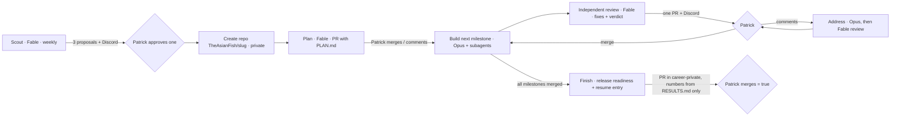

# Project builder: agent-built portfolio projects

Projects are the main signal internship screeners use to judge whether
Patrick can do an AI-leaning SWE role. This pipeline turns that into
background work on his Max plan, with Patrick deciding what to build and
approving every step. Decision record: AD-32.

## The loop

- **One project and one open PR at a time.** A run that finds an agent PR
  waiting for Patrick spends no compute. The pace follows his reviews.
- **Autopilot (opt-in per project).** With `autopilot: true` in
  `projects.yaml`, a PR that passed the Fable review (a hidden `<!-- review:
  pass -->` marker in its body; the review itself is private), has green CI, and had no activity for 12 hours is
  merged by the builder. Off by default.
- **Wake-up (AD-35).** The ~10-minute scan chain starts the builder as soon as
  it has work (your merge or comments, an autopilot merge, the next
  milestone) and posts what it started to `#projects`.
- **Cadence.** A builder step every 3 hours (`17 */3 * * *`, unreliable on
  GitHub, hence the wake-up above), a scout run on Mondays 09:00 PT, a study
  pack on Sundays. Hard caps: Opus build ≤ 230 min, Fable review ≤ 70 min.
  Replay's M1 (scaffold, CI, first vertical slice, review) took 49 minutes.
- **Progress pings (AD-36).** While a session runs, `#projects` gets a line
  every 20 minutes (elapsed time, commits, latest commit, files changed);
  two quiet intervals are flagged as possibly stuck.
- **Notifications.** When a PR opens, `#projects` says whether autopilot will
  merge it (review passed) or it needs Patrick; `#study` links the private
  study notes for that run.

## Authorship (AD-34)

Everything in a project repo reads as Patrick's own work: commits authored
and committed as TheAsianFish (commit-msg hook strips attribution lines),
`dev/...` branches, first-person PR text, CONTRIBUTING.md instead of a tracked
CLAUDE.md (copied to an untracked one for sessions), no mention of AI
authorship or of Patrick in third person. Agents commit often, one logical
step per commit. All teaching, "his piece", review notes and the verdict stay
private: `.agent/learn.md` and `.agent/review.md` are saved to
`career-private/study/<slug>/<date>-<stage>.md` and announced in `#study`.

## What Patrick does

| To... | Do this |
|---|---|
| Approve a proposed project | Actions → **Project builder** → Run workflow → `approve`, project `<slug>` (GitHub app works), or set `status: approved` in `resume/private/projects.yaml`, or `uv run opportunity-radar projects approve <slug>` |
| Request changes | Comment on the agent's PR (any comment counts; addressed next run) |
| Continue | Merge the PR |
| Stop / never build | `pause` / `reject` the same way |
| Get new ideas now | Run workflow → `scout` |
| Let it run unattended | `autopilot: true` on that project |
| Publish / deploy | Follow the project's `RELEASE.md` (agents never sign up for services or use credentials) |

## Models and roles

| Stage | Model | Why |
|---|---|---|
| Scout, plan, review, finish, study | Fable 5.1 (`--model fable`, falls back to Opus) | Most capable: research, architecture, a demanding review that re-runs tests/evals, and the resume entry, results write-up and interview prep |
| Build, address comments | Opus 5.5 (`--model opus`) | Long agentic coding sessions |
| Subagents (any stage) | Chosen per task | `fable` for hard reasoning and adversarial verification, `opus` for big implementation, `sonnet` for routine well-specified work, `haiku` for search and CI/log triage; as many or as few as the work needs (`standards.md`) |
| Replay/Kiln's own model calls | Cheapest that answers | Evals and the product use a capped `ANTHROPIC_API_KEY`; the model per call is recorded in RESULTS.md |

All prompts live in `agents/prompts/projects/` and start with
`standards.md` (the quality bar: real users, depth over breadth, measured
claims only, production engineering, AI stack used well, no AI attribution).

## Safety and privacy

- The build job never checks out the private career repo; sessions get only
  a skills summary. The resume stays private.
- `AGENT_GH_TOKEN` is used in clone/push/PR steps only. The Claude sessions
  run with credential-free remotes and only `CLAUDE_CODE_OAUTH_TOKEN` plus the
  capped `ANTHROPIC_API_KEY` (from the `PROJECTS_ANTHROPIC_API_KEY` secret, for
  real evals; never the Max token) in the environment, so an agent cannot
  push, create repos, or touch other repos. Verify that key any time with
  Actions → Project builder → Run workflow → `keycheck` (one 1-token call;
  logs print the HTTP status only).
- `AGENT_GH_TOKEN` (fine-grained PAT, all repos) needs read/write on
  Contents, Pull requests, Administration (create repos) and Workflows, plus
  **read** on Actions and Commit statuses: the builder reads a PR's CI result
  before it decides anything (from the PR's checks, or from the Actions runs of
  its head commit when the token can't read check runs). If any step can't decide, `#projects` gets a
  "needs attention" message (repeats at most every 3 hours until fixed).
- A `commit-msg` hook strips AI attribution; commits are authored as
  TheAsianFish.
- This repo is public, so workflow logs print stages and run statistics only.

## Truth

A project reaches the resume only through a pull request in the private repo
that adds it as a commented-out (reserve) entry. The builder flags any number
in its bullets that does not appear in the project's `RESULTS.md` (measured
by a real run), and merging means "this is true". Patrick should be able to
explain every line; the private study notes for each milestone
(`career-private/study/<slug>/`), the Sunday study pack and the mock interview
written at the finish stage are how he learns the codebase.
